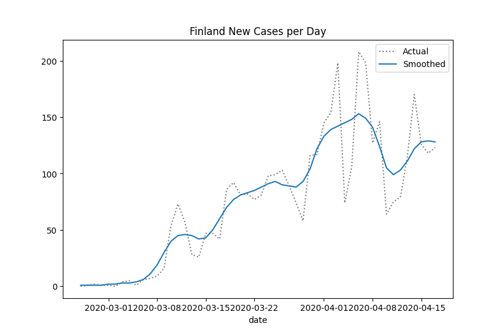
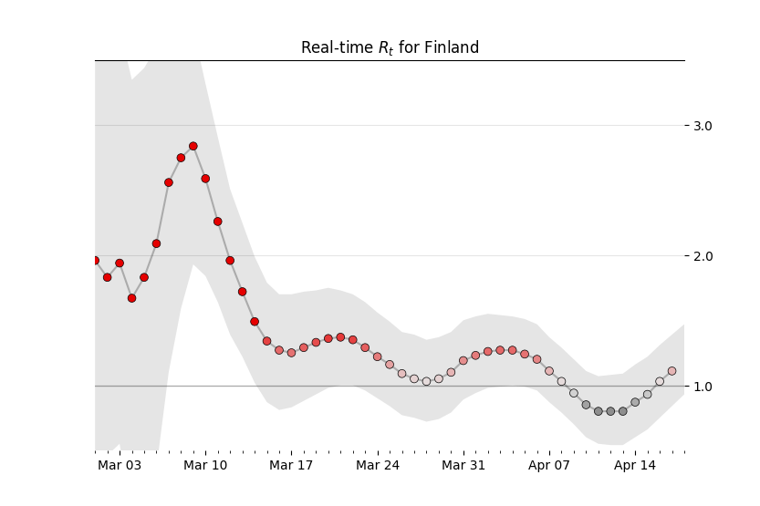

## Finnish effective reproduction number (R_t) calculation for covid-19

This projects contains a jupyter notebook to calculate and visualise Finnish R_t based on current THL data `finland.ipynb`.

The other part of his project `calculationR` contains the same code as a Azure Function that runs every 12 h and writes the results and graphs to azure blob directory.
To use this part of the code, you need to define the relevant azure blob storaga parameters 
 `CONTAINER_NAME"` and `CONNECTION_STRING` in `calculationR/calc_r.py` 
 
 `requirements.txt` contains the python requirements for both projects
 
The original notebook and explanation of the calculation is in the notebook `Realtime R0.ipynb` is by Kevin Systrom and is further explained in the following blog post
 
 
http://systrom.com/blog/the-metric-we-need-to-manage-covid-19/

### Example images from the calculation

